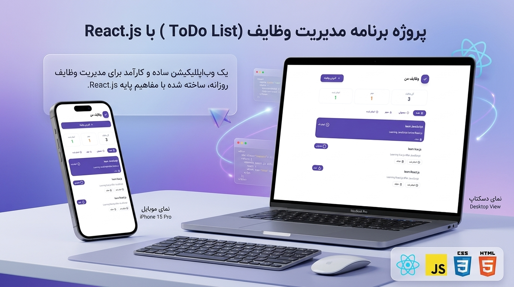

# React Todo List

A simple Todo List application built with **React.js** as a learning project.

This project was created when I was starting to learn React and was mainly focused on practicing React fundamentals and building interactive user interfaces.

## 🚀 Features

- Add new tasks
- Delete tasks
- Mark tasks as completed
- View the list of tasks
- Interactive and responsive UI

## 🛠️ Technologies

- React.js
- JavaScript
- HTML5
- CSS3

## 📦 Installation

Clone the repository:

```bash
git clone https://github.com/YOUR_USERNAME/YOUR_REPOSITORY.git
```

Navigate to the project directory:

```bash
cd YOUR_REPOSITORY
```

Install the dependencies:

```bash
npm install
```

Start the development server:

```bash
npm run dev
```

The application will then be available on the local development server.

## 🎯 Purpose

The main purpose of this project was to practice the fundamentals of React, including:

- Components
- Props
- State management with `useState`
- Event handling
- Rendering lists
- Conditional rendering
- Basic React project structure

## 📸 Preview

_Add a screenshot of the application here._


```

## 📚 Status

This project is a learning project and represents one of my early experiences with React.

## 👨‍💻 Author

**Ali Reza Salari**

GitHub: [Your GitHub Profile](https://github.com/YOUR_USERNAME)